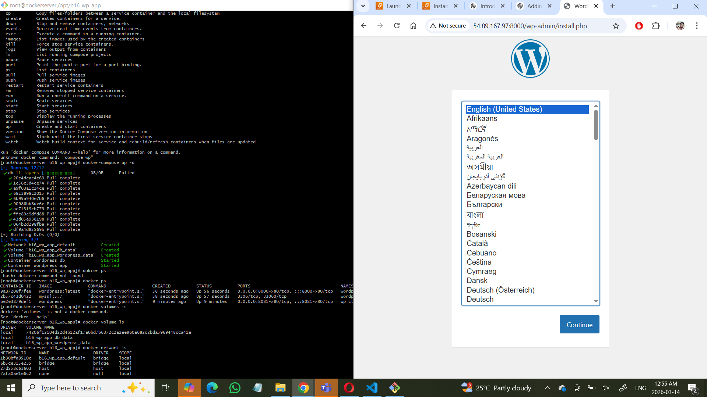

Docker compose Installation :

sudo curl -L "https://github.com/docker/compose/releases/download/v2.23.1/docker-compose-$(uname -s)-$(uname -m)" -o /usr/local/bin/docker-compose

sudo chmod +x /usr/local/bin/docker-compose 

docker-compose version 

docker-compose up -d 
  docker-compose down --volumes 

## Screenshots

## Project Output

After running docker-compose, the application runs successfully in the browser.

### Docker Compose Application Output

