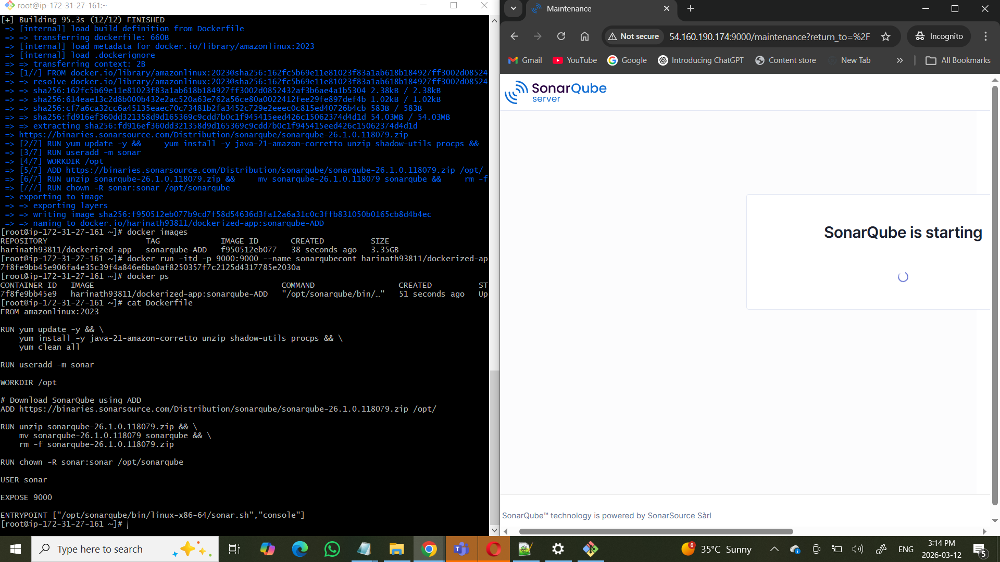

# SonarQube Dockerized Setup


Author: Harinath  
GitHub: https://github.com/Harinath234  
DockerHub: https://hub.docker.com/r/harinath93811/dockerized-app/tags

---

## Project Description

This project demonstrates multiple approaches to containerizing **SonarQube** using Docker on **Ubuntu and Amazon Linux** environments.

Several Docker images were built and pushed to Docker Hub using different methods such as **wget, curl, and ADD instructions**.

The setup includes automated dependency installation like **Java 21, unzip, procps**, and runs the container using **non-root execution** for better security.

SonarQube was downloaded in two ways:

- Direct download inside Dockerfile using `wget`
- External download and copied into the Docker image during build

---
## Architecture

```

Developer
   │
   │ docker build
   ▼
Docker Image
   │
   │ docker push
   ▼
Docker Hub (Image Registry)
   │
   │ docker pull
   ▼
Docker Container (SonarQube)
   │
   │ Exposed Port
   ▼
Browser Access
http://localhost:9000

```

---

## Screenshots




---

## Pull Image and Run Container

### Pull Docker Image

docker pull harinath93811/dockerized-app:sonarqube-wget

### Run Container

docker run -itd -p 9000:9000 --name sonarqubecont harinath93811/dockerized-app:sonarqube-wget

#### Access SonarQube

Open the browser and visit:

http://localhost:9000

### Default Login

Username: admin
Password: admin
